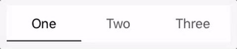

# airSegmentedControl

A UIControl subclass that draws itself based on the number of segments provided.

## How to use airSegmentedControl

Installation is best managed using Carthage. Add `github "airg/iOS-airSegmentedControl"` to your cartfile and run `carthage install`, see [Carthage Installation Guide](https://github.com/Carthage/Carthage#if-youre-building-for-ios-tvos-or-watchos).

To get `IBDesignable` and `IBInspectable` to work in Interface Builder, add the [InspectableAirSegmentedControl file](https://github.com/airG/iOS-airSegmentedControl/blob/master/AirSegmentedControl/InspectableAirSegmentedControl.swift) to your project and use the `InspectableAirSegmentedControl` subclass.

## Documentation

Check out the [documentation](https://airg.github.io/ios-airSegmentedControl/). All calls should also be documented in the generated Swift interface.

## How it's made

airSegmentedControl is currently written in Swift 4 with Xcode 9.2.

Documentation is generated using [Jazzy](https://github.com/realm/jazzy), a very useful tool for generating pretty docs.

## Contributing

Before opening a pull request, be sure to run `jazzy` to regenerate the docs.
